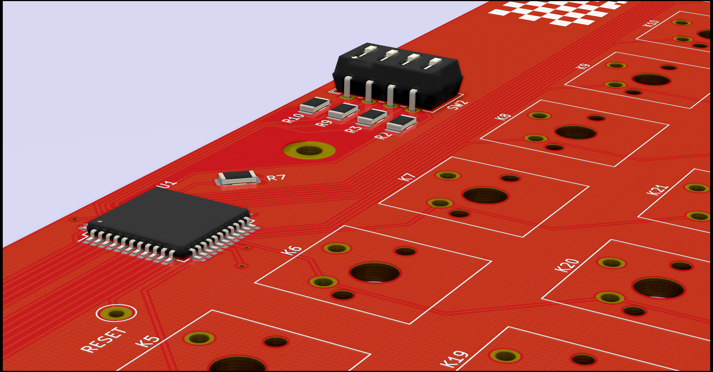
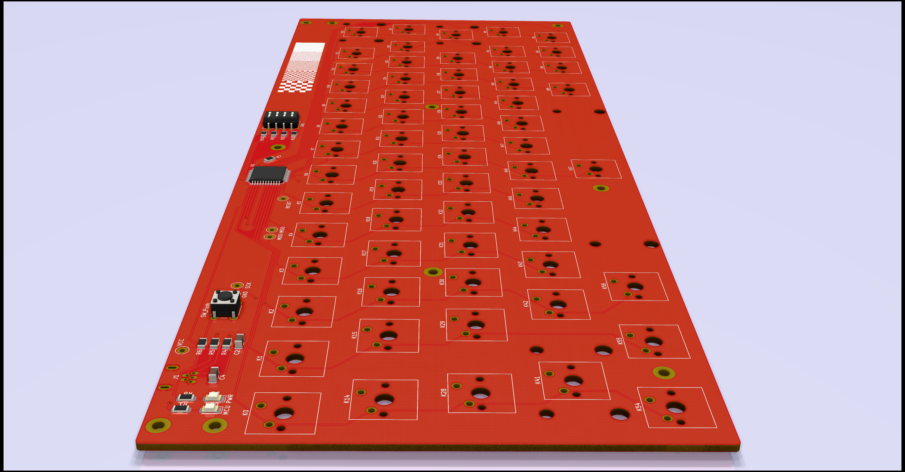
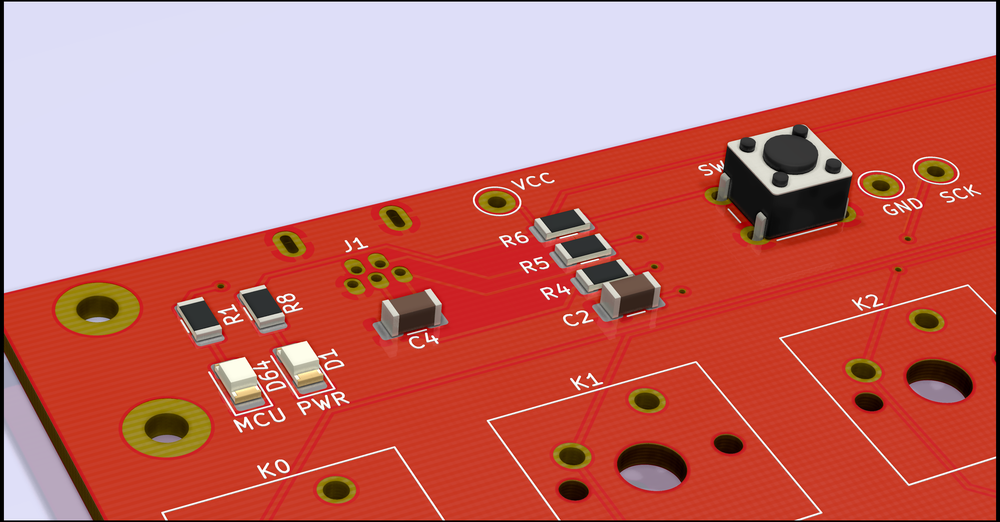
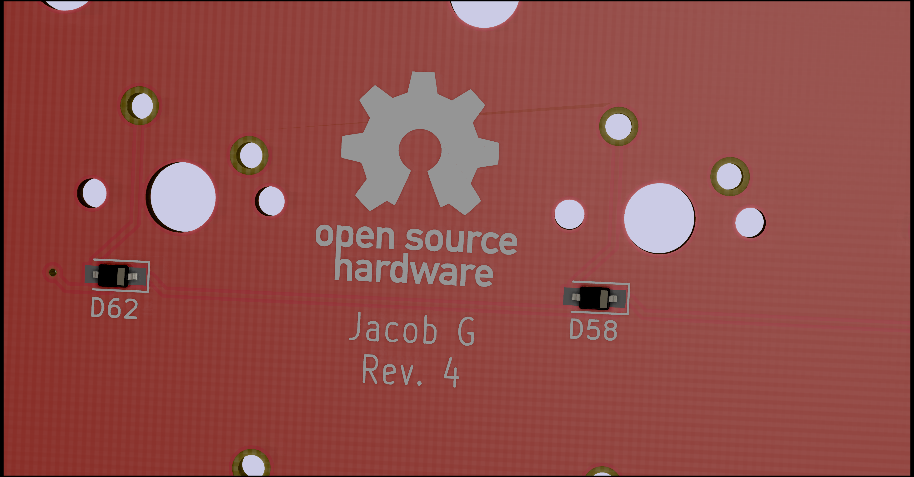

# My keyboard

Here's the CAD files and the firmware (which isn't yet written) for a keyboard I'm making.

I'm using KiCAD to create the schematic and PCB design.

I'm using an ATmega32u4 microcontroller to send data to the computer.

